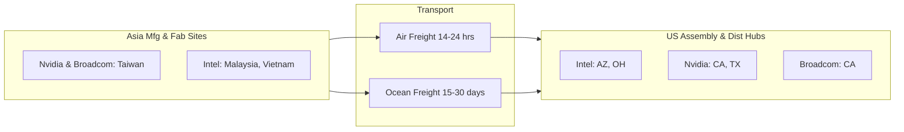

# OmniLogix AI Live Dashboard

**Real-time synthetic data augmentation for tracking semiconductor supply chains across trans-Pacific routes.**  
Monitoring Intel, Nvidia, and Broadcom logistics.

---

## Key Metrics

| Metric | Value | Status |
|--------|-------|--------|
| **Active Shipments** | 1,248 | ▲ 12% vs Last Week |
| **Avg Transit Delay** | 1.4 Days | Synthetic Risk Elevated |
| **Synthetic Threat Index** | 72/100 | Typhoon Warning Active |
| **AI Confidence** | 94.6% | Model Re-trained 2h ago |

---

## Trans-Pacific Node Architecture

The global semiconductor supply chain is highly segmented. Raw silicon processing and advanced fabrication primarily occur in Asian foundries. Final assembly, testing, and distribution for major tech giants are strategically split between Asian hubs and domestic US facilities to mitigate geopolitical and logistical friction.

### Asia Manufacturing & Fab Sites

| Company | Location | Function |
|---------|----------|----------|
| **Nvidia & Broadcom** | 🇹🇼 Hsinchu, Taiwan | TSMC Fab |
| **Nvidia & Broadcom** | 🇹🇼 Taoyuan, Taiwan | Assembly |
| **Intel** | 🇲🇾 Penang, Malaysia | Assembly/Test |
| **Intel** | 🇻🇳 Ho Chi Minh, Vietnam | Assembly |

### US Assembly & Distribution Hubs

| Company | Location | Function |
|---------|----------|----------|
| **Intel** | 🇺🇸 Chandler, AZ | Fab/Assembly |
| **Intel** | 🇺🇸 New Albany, OH | Mega-Fab Building |
| **Nvidia** | 🇺🇸 Santa Clara, CA | HQ/Distribution |
| **Nvidia** | 🇺🇸 Austin, TX | Logistics Hub |
| **Broadcom** | 🇺🇸 San Jose, CA | Dist/Config |
| **Broadcom** | 🇺🇸 Irvine, CA | Logistics Hub |

---

## Logistics Volume Distribution

*Comparing the proportion of manufacturing and assembly loads processed per week across key geographic sectors.*

| Region | Nvidia | Broadcom | Intel |
|--------|--------|----------|-------|
| Taiwan (TSMC/Foxconn) | 85 | 75 | 20 |
| Malaysia (Intel Assembly) | 5 | 10 | 90 |
| US West Coast Hubs | 60 | 50 | 30 |
| US Inland Facilities | 20 | 15 | 80 |

---

## Transit Efficiency Profile

*Analyzing route cost versus transit time. Bubble size indicates total shipped volume in metric tons.*

| Route | Transit Time | Cost per Ton (USD) | Relative Volume |
|-------|--------------|-------------------|-----------------|
| Taipei → SFO (Air) | 1.5 days | $8,500 | Small |
| Kaohsiung → LAX (Ocean) | 22 days | $1,200 | Large |
| Penang → AZ (Air) | 2 days | $9,200 | Small |
| Penang → LAX (Ocean) | 28 days | $1,100 | Medium |

---

## Synthetic Data Augmentation Matrix

Traditional historical models fail during unprecedented global events. By injecting dynamic synthetic data—such as simulated typhoon landfalls in the South China Sea, unannounced port labor strikes in Long Beach, and sudden geopolitical tariff implementations—our AI trains robust predictive algorithms capable of preemptive rerouting.

### Risk Factor Sensitivity

*Radar analysis shows how strongly current supply chain node configurations react to distinct categories of synthetic environmental and political stress injections.*

| Risk Factor | Current Operations | AI Simulated Max Stress |
|-------------|-------------------|-------------------------|
| Typhoon / Extreme Weather | 45 | 95 |
| Port Labor Strikes | 60 | 85 |
| Tariff Imposition | 30 | 90 |
| Air Freight Fuel Spike | 80 | 95 |
| Geopolitical Blockades | 20 | 100 |

### Predictive Delay Modeling

*Live AI performance. Contrasts standard expected delivery timelines against AI-predicted delays after injecting live weather anomaly and port congestion synthetic data streams.*

| Day | Standard Baseline (Hours) | AI Predicted Delay (Hours) |
|-----|---------------------------|----------------------------|
| Day 1 | 2 | 2 |
| Day 2 | 3 | 5 |
| Day 3 | 2 | 12 |
| Day 4 | 4 | 24 |
| Day 5 | 3 | 38 |
| Day 6 | 5 | 42 |
| Day 7 | 4 | 35 |

---

## Methodology Notes

- **Palette:** Vibrant Cyber/Neon (Background: #0f172a, Accents: #06b6d4, #ec4899, #8b5cf6, #f59e0b)
- **Chart Choices:** Stacked Bar for Volume (compare parts to whole), Bubble for Transit (relationships between Cost/Time/Vol), Radar for Risk (multivariate factors), Line for Delay Modeling (change over time)
- **Plan Summary:** 1. Global Network overview, 2. Volume & Transit analysis, 3. Synthetic Data injection impact

---

> **Interactive version:** See `gemini_infographic.html` for the full dashboard with Chart.js visualizations. Open in a browser to view the live charts.
