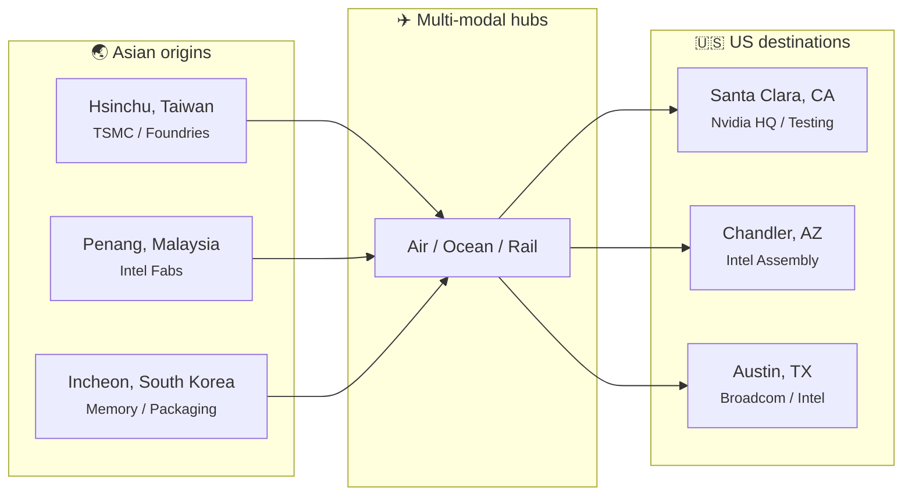
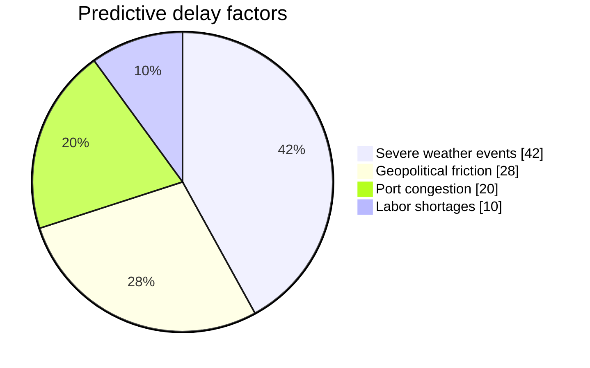

# 🚀 AI-Augmented Semiconductor Supply Chain

> Live tracking profiles and actionable predictions for operations managers. Integrating synthetic logistics data (weather, geopolitics, congestion) to forecast accurate transport times from Asian manufacturing sites to US assembly locations.

---

## Key metrics

| Metric | Value | Note |
|--------|--------|------|
| **Global tracked shipments** | **1,402** | ▲ 12% vs last month |
| **Avg port congestion delay** | **+4.2 days** | Synthetic model warning |
| **AI routing optimization** | **94.8%** | On-time delivery rate |

---

## Critical semiconductor logistics nodes

Primary transport corridors between Asian manufacturing hubs (foundries, memory) and US assembly, testing, and distribution centers.

| Origin | Multi-modal hubs | Destination |
|--------|------------------|-------------|
| **Hsinchu, Taiwan** (TSMC / Foundries) | Air / Ocean / Rail | **Santa Clara, CA** (Nvidia HQ / Testing) |
| **Penang, Malaysia** (Intel Fabs) | Air / Ocean / Truck | **Chandler, AZ** (Intel Assembly) |
| **Incheon, South Korea** (Memory / Packaging) | Air / Ocean / Rail | **Austin, TX** (Broadcom / Intel) |

---

## Multi-modal transport times (days)

Baseline comparison of transit durations by route and modality. Expedited air vs high-volume ocean/rail hybrid.

| Route | Air freight | Ocean freight | Multi-modal / land |
|-------|-------------|---------------|----------------------|
| Hsinchu → Santa Clara | **3** | 21 | 24 |
| Penang → Chandler | **5** | 30 | 35 |
| Incheon → Austin | **4** | 25 | 29 |

*Source: AI-augmented logistics baseline.*

---

## Geopolitical & weather disruption profiles

AI-generated synthetic projections for **Hsinchu → Santa Clara (ocean)**. Injected variables (e.g. South China Sea typhoons, tariff inspections) alter predicted arrival over a 30-day window.

| Day | Baseline (days) | AI synthesized delay (days) |
|-----|------------------|------------------------------|
| 1 | 21 | 21 |
| 5 | 21 | 21.5 |
| 10 | 21 | 24 |
| 15 | 21 | 28 |
| 20 | 21 | 31 |
| 25 | 21 | 27 |
| 30 | 21 | 24 |

- **Baseline:** fixed 21-day ocean estimate.  
- **AI trajectory:** synthetic delays from weather and geopolitics; peak delay ~31 days at Day 20.

---

## Synthetic data matrix

The AI database combines real-time logistical telemetry with external risk factors to drive routing and inventory buffers.

| Factor | Description |
|--------|--------------|
| **Meteorological constraints** | Typhoon tracking, atmospheric pressure anomalies affecting air freight weight limits. |
| **Geopolitical friction** | Tariff implementations, localized export restrictions, customs holding pattern probability. |
| **Infrastructural bottlenecks** | Port congestion indices, chassis shortages at receiving docks (Long Beach / LA). |

---

## Predictive model weighting

Distribution of impact variables used by the AI to calculate logistical delays. Weather and infrastructure dominate variance.

| Factor | Weight |
|--------|--------|
| Severe weather events | **42%** |
| Geopolitical friction | **28%** |
| Port congestion | **20%** |
| Labor shortages | **10%** |

---

*Infographic derived from AI-augmented semiconductor supply chain logistics. Renders on GitHub with Mermaid (flowchart, pie) and Markdown tables.*
